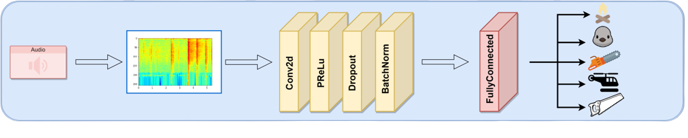
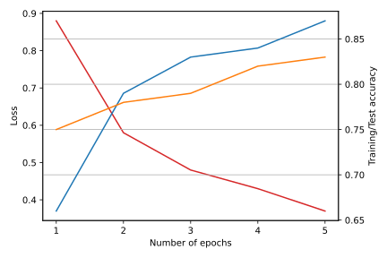
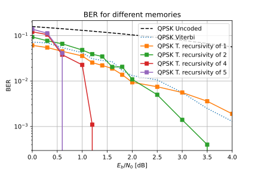
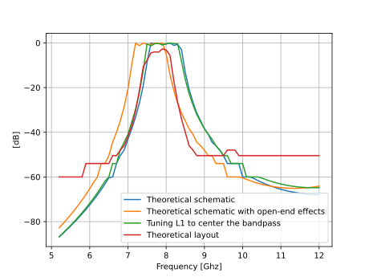

# [Project 1 : Audio Classification using CNN](https://github.com/martinflor/CNN-ESC50Dataset)

- Audio Monitoring of forests
- Preventing from abnormal events (Sawing, crackling fire, ...)
- Convolutional Neural Network (Pytorch)
- Audio processing (Spectrograms, melspectrograms, ...)
- Data Augmentation (Time Shift, Masking, Noise, Scaling, ...)
- Hyperparameters Tuning

# [Project 2 : Tumor individuals prediction](https://github.com/martinflor/Single-cell-expression)
- Single Cell Expression Data
- Imbalanced Dataset
- Feature Reduction (Empty columns, NaN values, correlation, ...)
- Ensemble (Decision Trees)

# [Project 3 : Intel Image Classification using Pytorch](https://github.com/martinflor/IntelClassification)
- Small Project on image classification
- Intel Image dataset (150x150)
- Large Dataset
- Data transformations (torchvision)
- Convolutional Neural Network (Conv2d, BatchNorm, ReLU, MaxPool2d, ...)

# [Project 4 : Turbocodes : Road to Shannon Limit]()
- Python Project
- Uncoded 4-QAM transmission chain
- Convolutional Encoding
- Viterbi decoding
- BCJR decoding
- Turbocodes

# [Project 5 : Tchebyshev Coupled Line Bandpass Filter]()
- ADS project
- Bandpass filters for Radio-Frequency
- Simulation and Layout on ADS
- Design and tuning

