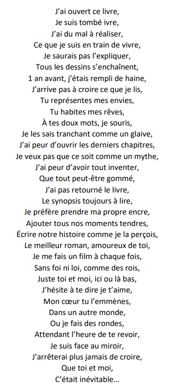

Laissez moi vous conter les fabuleuses aventures d'un pivert et d'un sublime castor !

Bien que ces deux là ne se connaissaient que depuis récemment, ils eurent la magnifique idée de tomber amoureux l'un
de l'autre. Le pivert était fou amoureux de celle qu'il surnommait son "petit castor". Il avait pour habitude de 
rêver d'elle, en même temps, il faut le comprendre, le castor était d'une beauté sans pareille et avait le bon goût
de s'habiller particulièrement bien, de telle manière qu'elle pouvait envoûter le pivert d'un simple regard.

Un beau jour, le pivert et le castor eurent envie d'entreprendre l'une des plus belles aventures qui allaient les 
lier plus que jamais. Alors qu'ils avaient tout deux besoin de dépaysement, ils décidèrent de partir dans un endroit
plutôt exotique pour un pivert et un castor. Un pays où le soleil brillait de mille feux, là où la mer les faisait
rêver et surtout où leurs préoccupations de tous les jours n'étaient que de vagues souvenirs.

Une fois arrivés là bas, ils passèrent leurs plus beaux moments ensemble. Ils étaient en communion, l'un avec
l'autre sans penser à rien d'autre. C'était ce qu'on appellait la "Passionnneeeeee". Ils passaient leurs temps à
s'embrasser fougeusement, se baladaient main dans la main et parfois rentraient se reposer une, deux (voir trois)
heures à l'hotel, histoire de se reposer (ou pas).

C'était hors du temps et d'une symbiose incroyable ! Mais alors toi lecteur tu dois surement te demander où 
nos deux aventuriers se sont rendus ! Un beau coin, perdu dans l'Espagne du nom de Vittoria.

C'est alors que nos deux protagonistes décidèrent de lier leur présent et leur futur par un élément symbolique. De manière très originale, ils achetèrent un cadenas qui allait représenter leur union émotionelle/charnelle, peu importe, cela représentait simplement ce qu'ils étaient l'un pour l'autre. 

La folle idée leur traversa l'esprit de laisser un cadena dans chaque coin du monde qu'ils visiteraient à l'avenir ! 

[Mais alors où se trouve ce fameux cadenas ?](https://earth.google.com/web/search/42%c2%b050%2739%27%27N+2%c2%b040%2732%27%27W/@42.8441667,-2.6755556,528.52593762a,749.88611897d,35y,0h,45t,0r/data=ClwaMhIsGaVviKcNbEVAIYoJxbGJZwXAKhg0MsKwNTAnMzknJ04gMsKwNDAnMzInJ1cYAiABIiYKJAmkutX2iL0zQBGiutX2iL0zwBlZvGMm7GMfQCHj-bTXykhXwCgC)

Quel parc magnifique pour un pivert et un castor y passer leurs meilleurs journées ! Malheureusement, le retour dans leurs habitats naturels respectifs est nécessaire ... En effet, ils ne peuvent vivre ensemble éternellement car leurs modes de vie sont encore trop différents ... C'est alors que la peau bronzée (surtout pour notre castor car le pivert protégeait ces petites ailes) et la tête plein de rêves, nos deux amis se demandent où pourraient-ils bien répandre leur passion et disperser un nouveau cadenas ..?

Depuis ce voyage, ils ne cessèrent de repenser à ces quelques jours ensemble ! Mais quand est-ce qu'ils pourront revivre pareils moments ? 

Mai 2022, l'été arrive à grand pas ! Alors que notre rongeur favori et notre moineau un peu malade allaient entamer un pan d'histoire pour le moins mouvementé, la question qui nous brule la langue, qui est sur le bord des lèvres : Où ces deux là vont bien ils pouvoir se rendre pour leur prochaine destination ???

- [Un soleil de plomb et des vestiges sans pareil ...](https://earth.google.com/web/search/Ghiz%c3%a9e/@29.9772962,31.1324955,64.28935052a,900.52414138d,35y,0h,45t,0r/data=CnIaSBJCCiUweDE0NTg0ZjdkZTIzOWJiY2Q6MHhjYTc0NzQzNTVhNmUzNjhiGUyBcRUw-j1AIf5dnznrIT9AKgdHaGl6w6llGAIgASImCiQJdqFapmduRUAR5a1MzqFrRUAZ0OBNemo0BcAhpgtDmhd4BcAoAg)
- [Un poil plus penché mais nos amis savent s'adapter ...](https://earth.google.com/web/search/tour+de+pise/@43.722952,10.396597,32.22407251a,738.16875914d,35y,0h,45t,0r/data=CncaTRJHCiUweDEyZDU5MWE2YzQ0ZTg4Y2Q6MHgzMmVjYTliMWQ1NTRmYzAzGfVJ7rCJ3EVAIShiEcMOyyRAKgx0b3VyIGRlIHBpc2UYAiABIiYKJAnqiuTsqLlHQBFn2-KKLjdEQBn0HaSJDWk0QCFE-vDvdtcBwCgC)
- [Face à l'histoire d'un des plus beaux pays ...](https://earth.google.com/web/search/Acropolis,+Dionysiou+Areopagitou,+Athina+105+58,+Gr%c3%a8ce/@37.9696365,23.7268983,88.48305093a,811.77629663d,35y,0h,45t,0r/data=CqIBGngScgolMHgxNGExYmQxOWU1ZjgwNDEzOjB4NjYyYWE1NDQ4ZTkxMWY0NBkDQYAMHfxCQCGbBMoBFro3QCo3QWNyb3BvbGlzLCBEaW9ueXNpb3UgQXJlb3BhZ2l0b3UsIEF0aGluYSAxMDUgNTgsIEdyw6hjZRgCIAEiJgokCbcuVtKn_kJAEYPJRJLB-0JAGZ7j6kTRuDdAIRuTN7oKsjdAKAI)

[Journal de Bord : 28 Mai 2022]

Nos deux animaux favoris viennent de passer leur première semaine complète, ensemble, de leur vie ! Et quelle semaine ! Certes, celle-ci fût chargée en lourdes tâches, pendant que notre castor continuait de renforcer son barrage, notre pivert quant à lui se tuait à construire son petit nid futur. Néanmoins, ces deux là ont également eu bien du temps pour eux. Chaque pause de labeur fût un réel soulagement pour les fous l'un de l'autre. Ils se savaient déjà complices mais une semaine passée dans les bras l'un de l'autre, chaque jour, n'a fait que renforcer l'amour qu'ils éprouvaient. En effet, au cours de cette belle semaine, tantôt ensoleillée tantôt pluvieuse, nos deux compères se sont encore d'avantage rapprochés à tel point que parfois ils n'avaient l'impression de ne former qu'un ! Entre réveil à l'aube côte à côte, baignade du matin pour se raffraichir en companie de l'autre ou encore sieste dans le nid du pivert rimant parfois avec repos et parfois avec agitation, notre couple a bien pu profiter malgré le lourd travail qui les attendait respectivement. Malheureusement, tout a une fin et pour le coup, notre amie le castor a finalement dû rentrer chez elle pour se consacrer à la construction d'un autre barrage. C'est alors que la séparation fût dure pour nos compères, le pivert au bord de la rivière vit son cher castor s'éloigner peu à peu de lui dans la tumultueuse rivière. L'éloignement se fit vite ressentir, les moments à deux sont devenus des moments seul, les réveils étaient désormais en solitaire et les couchés aussi. Chaque jour, le pivert ne pouvait s'empêcher de repenser à tous ses bons moments au côté de son petit castor, comme il aimait la surnommer. Seul avec ses pensées, il se voyait allongé au côté du petit castor qui avait les yeux fermés, épuisée par la fatigue. Du long de ses longues ailes, il la caraissait doucement, voyant le castor s'endormir petit à petit, son visage s'adoucissant, ses muscles se détendant, rejoignant ainsi les bras de Morphée. Il se demandait alors à quoi elle pouvait bien penser, de quoi pouvait-elle rêver, rêvait-elle de lui ? de eux ? Il ne le savait pas. Une chose était sûre, c'est que lui oui. Presque tous les jours, il s'imaginait bras dessus bras dessous, au bout du monde avec son compagnon le castor, visitant les plus beaux lieux, rigolant de tout et de rien ... débattant de la pluie et du beau temps ... admirrant son doux visage ... la caressant avant de s'endormir ... se baignant dans les rivières du monde entier. Il rêvait des places les plus magnifiques, c'était comme dans un film, il n'arrêtait pas de se demander ce qu'il pouvait faire pour continuer de séduire cet être sublime qui l'accompagnait, que pouvait-il dire, mettre en place, inventer, imaginer, créer, peu importe ... pour conquérir encore un peu plus le petit coeur du castor. Il imaginait alors tous les voyages du monde !  Il s'imaginait sur les longues routes désertes américaines, en décapotable (très spécial pour un castor et un pivert mais eux aussi on le droit d'aimer les belles voitures voyons !). Il s'imaginait faire du ski à deux sur une piste rien qu'à eux, observant d'abord la montagne, le beau soleil, descendant petit à petit, profitant du paysage. Il s'imaginait dans les pyramides, passant devant des millénaires d'histoires, prenant la main du castor, l'emmenant à toute allure sans aucune raison de rues en rues, l'embrassait car il le voulait, la prenait par la taille car il en avait l'envie. Il s'imaginait en randonnée sur la muraille de Chine, il s'imaginait en haut d'un sanctuaire perdu sur une montagne d'Amérique du Sud, il s'imaginait danser le tango espagnol à Florence (certes c'est en Italie, mais la géographie n'était pas le point fort du pivert), il s'imaginait se battre avec son castor pendant des heures à deux sur un tatami rigolant à ne plus en pouvoir, il s'imaginait au pied d'un volcan en lui disant que son coeur allait rentrer en éruption pour elle (le pivert était drageur amateur parfois), il s'imaginait en haut de  la Tour Eiffel, en bas la Tour de Pise, face à la fontaine de Trévis, au pied des marches d'un sanctuaire Maya,
devant le Sphinx, ou encore devant le Taj Mahal. Il s'imaginait chez lui ... chez elle ... tout simplement. 

Le pivert s'en souvenait encore au bord de la rivière ce jour là, quand il eut à la laisser partir. Il s'en souvient très bien. Il avait la gorge serrée, pour la première fois, il ressentait des larmes monter. Il s'en était caché bien évidemment mais ce sentiment il l'avait ressenti. Pour la première fois de sa vie,
notre très cher pivert comprit qu'il tenait à quelqu'un comme il n'avait jamais tenu à quelqu'un auparavant. La séparation lui avait fait prendre conscience qu'il tenait au castor d'une manière extraordinaire. Ce jour-là, le pivert eut l'impression qu'une partie de lui avait décidé de le quitter et de partir loin.

Alors, ces derniers jours, le pivert rêve toujours de tous ces voyages magnifiques qu'il est impatient de faireau côté du castor mais ... ce dont il a le plus envie ... c'est simplement de la revoir.

[E-mail du pivert au castor : Archive du 16 Décembre 2022]

"Hello, comment ça va ici ?

Ce mail est une bouteille lancée à la mer (ou son analogie digitale si on préfère).
J'espère que j'écris à la bonne personne sinon c'est un peu chiant. 
Je sais que tu ne regardes pas tout le temps cette boite mail donc normalement tu ne devrais pas voir ce mail tout de suite. Mais bon même si tu le vois dans les jours qui suivent cette rédaction, ce n'est pas très grave en soit, les questions ne sont peut-être pas encore les plus pertinents mais rien n'empêche d'y revenir ultérieurement.

Petites listes de questions : 
- Comment ça va la tout de suite ?
- Quelle année sommes-nous ? Quel mois ? 
- Que s'est-il passé depuis l'envoi de ce mail ? Est-ce que tout va pour le mieux ? Je l'espère... 
- Est-ce que ton mec a toujours des idées un peu farfelues, du genre t'écrire des mails pour un futur plus ou moins proche ?
- Est-ce que vous êtes ensemble depuis plus d'un an maintenant ? (c'est peu probable, je serai trop impatient de te dire que t'as un mail qui t'attends)
- Avez-vous passé votre 1ère St. Valentin ? Comment était-ce ? Des clichés ont été réalisé ou êtes-vous restés dans vos habitudes ?
- Une note sur 20 à propos de Florian (Ouais ça gratte de ouf) (j'ai la flemme de mettre les emojis, imagine les 😂 juste après)
- Avez-vous fini les Harry Potter ? Et les animaux fantastiques ?
- Avez-vous été au cinéma ensemble du coup ? Les animaux fantastiques 3 ? 
- Quel est le film/série du moment ?
- Qui a gagné le combat de sol prévu ?
- Avez-vous survécu aux examens ?
- Comment était la soirée du dimanche 19/12/21 ? Avec l'esprit enfantin, etc ? 
- Alors les ardentes ? Vous y avez été ensemble ?
- Le surnom de chacun, c'est quoi finalement ? 
- Qui est la bête et qui est la belle dans le couple ?
- Comment se profile l'avenir ?
- Quels sont les projets actuels ? Des trucs prévus ensemble ?
- Qui manque le plus à l'autre ? (Ouais je fais des concours d'émotions nuls, et alors ?)
- Qui se souvient de la date ou vous vous êtes mis ensemble ? 
- Etes-vous dans le même endroit en ce moment ? Etes-vous dans le même lit ? Chloé dans les bras de Florian ? Si prévisible ... 
-Etes-vous déjà partis ensemble en vacances ? Ou voudriez-vous aller ensemble ? 
- Etes-vous aller dans la "vraie" maison de l'un et l'autre ? Donc vous avez rencontrés les parents de l'autre ? Wow ! Comment ça s'est passé ?
- Florian, as-tu réussi à obtenir une photo de Chloé ? Une photo de vous deux ? C'était pas une photo prise au dépourvu ? Genre elle a accepté ?!
- Est-ce que l'évènement planétaire a-t-il été réalisé ? Chloé a pris un verre d'eau ? Il y avait de la vittel j'espère, sinon honte à toi Florian ... 
- Avez-vous atteint les 100 messages d'un coup ? Vous êtes complètement cons si c'est le cas mdr
- Est-ce que Florian est finalement arrivé au bout de la playlist ? 
- Damso, prochain album ? (Je place ça au cas ou) 
- Spirit a-t-il été regardé ? Chloé a-t-elle chanté tout le long du film ?
- Avez-vous dormi ensemble sur un trampoline ? 

C'est déjà pas mal. J'espère que les réponses sont stylées. Que vous vous aimez, que tout va bien pour vous, je vous souhaite le meilleur. Soyez grands et comme a si bien dit Chloé, montrez-leur que vous avez le meilleur couple wooooow ! 

Bisouuus à vous deux, 

Flo le schizophrène."

[Journal de Bord : 1er Juillet 2022](https://www.youtube.com/watch?v=-r4Pu2s88eA&list=RD-r4Pu2s88eA&start_radio=1)

Alors que nos deux compaires ont pu réaliser une nouvelle escapade, courte mais malgré celà intense, voici un petit extrait en images des précédentes expéditions. Ils sont bientôt en route pour la suite !!

[Journal de Bord : 15 Mars 2023]()
"Je n’ai jamais ressenti une telle tristesse je pense. Je me sens seul et aussi très triste. Il y a des moments où ça va, je pense à autre chose, surtout si je suis avec d’autres personnes. Mais avec le mémoire, je suis principalement seul dans ma chambre et j’ai du mal à avancer parce que je ne fais que ressasser la même chose en boucle. Comment est-ce qu’on en est arrivé là ? Pourquoi est-ce j’ai laissé cette fille si incroyable ? Comment va se dérouler la suite ? Je me sens tellement perdu, j’ai plus aucune envie en ce moment, à part peut-être voir des gens et me changer les idées. J’en suis pas au point où j’en dors pas la nuit mais en même temps je suis tellement crevé tout le temps que je ressens fortement le besoin de dormir. J’ai plus aucune motivation, d’aller à la salle de sport, de manger correctement, de me mettre des objectifs, de travailler, … J’ai plus aucune envie à part tout laisser tomber, me laisser aller à la décadence et simplement manger n’importe quoi en jouant aux jeux vidéos. Je ressens également des moments incroyablement tristes, lorsque je repense à tous ces bons moments passés ensemble. Hier, j’ai été jeté la poubelle et j’ai regardé les étoiles. Je me suis souvenu de Chloé me parlant de « sa » constellation. Je me suis souvenu le début de notre histoire, là où, chez Anne-Lise, on regardait les étoiles ensemble. Je me souviens de cette fois où on avait été dans un champ avec une exploitation agricole dedans (c’était un peu flippant pour être honnête) et on allait simplement regarder les étoiles sans pollution lumineuse. Je me souviens de toutes ces fois où elle me disait de regarder la lune."

[Journal de Bord : 16 Mars 2023]()
Aujourd’hui, j’ai eu une interview avec une entreprise de consultance (ALTEN), et c’était vraiment sympa. C’était avec une RH, et on s’entendait bien, on rigolait un peu, j’étais détendu (sauf le moment où il m’a dit de parler en anglais ahah, même si ça s’est bien passé). Je sais toujours pas ce que je veux faire … J’hésite avec pleins de trucs et je vais surement suivre mon instinct au dernier moment mais bon … J’avais tellement envie d’en parler avec Chloé, de lui dire que c’était super sympa comme interview … mais je peux pas … Je lui ai envoyé un message aujourd’hui pour savoir comment ça allait. J’ai l’impression de l’avoir perdu à jamais. Je me demande si un jour je pourrai retrouver quelqu’un comme elle. Je la place tellement haut dans mon estime, elle est tellement incroyable que j’arrive pas à imaginer quelqu’un aussi bien. De toutes façons, pour le moment j’ai aucune envie … Je ressens aucun désir réel, en même temps la fin de Chloé et moi ça fait 2 jours à peine. J’ai commencé à écrire dans l’album souvenir qu’elle m’avait offert. J’ai commencé la suite de notre histoire hypothétique … Se réalisera-t-elle un jour ? Je l’espère …

[Journal de Bord : 17 Mars 2023]()
Je me suis senti tellement vide aujourd’hui. Je parlais avec des gens, avançais sur mon mémoire, j’ai eu un appel avec un entreprise et je m’en foutais de tout. J’étais en appel avec le type et ça s’est encore super bien passé, on rigolait etc mais quand lui parlait tout seul, j’écoutais pas. J’étais dans mes pensées en train de ressasser mes souvenirs avec Chloé. J’ai encore rouvert l’album photo que Chloé m’a fait et j’ai encore pleuré en le regardant évidemment. Je commence à être moins triste mais je me sens tellement plus vide … J’ai l’impression de ne plus rien avoir de structuré dans ma vie. Je ressens plus d’envie non plus … Chloé me manque tellement mais en même temps je peux pas essayer d’annuler la décision qu’on a pris ce début de semaine parce que j’ai aucune clarté sur mes pensées et que ça va repartir comme avant … Je comprends pas pourquoi je suis aussi perdu … Je me sens déprimé, aucune envie, aucun objectif réel, aucune direction à donner à ma vie … ça me fait peur, je sais pas ce que je vais devenir ces prochaines semaines/mois. J’ai l’impression de commencer à m’auto-détruire. J’arrête pas de repenser au passé et j’ai tellement de souvenirs auxquels j’avais plus penser depuis si longtemps et là ils refont surface. Et ils sont tous positifs … J’ai mis trois petits points parce que je sais pas si c’est positif ou pas … Les souvenirs sont positifs mais ça me rappelle à quel point j’ai peut-être perdu ces moments à tout jamais … J’aurais tellement envie d’être dans la phase où je donne tout pour la récupérer. Où je mets tout en œuvre pour reconquérir son cœur, ranimer la flamme, l’étincelle qu’il y avait entre nous … Mais là je peux pas, je suis pas en état … Je sais ce que je pourrais faire pourtant mais bon … J’ai commencé à écrire dans l’album photo, j’y ai fait une faute d’ailleurs comme un con … Bref … Je t’aime Chloé, je t’aime tellement …

[Journal de Bord : 20 Mars 2023]()
Je t’ai envoyé un message aujourd’hui pour savoir si ce vendredi t’allait au concert au final et si jamais t’avais personne qu’on y aille peut-être ensemble. Au final tu y vas avec ta sœur … J’ai tellement envie de te revoir et de pouvoir passer un moment avec toi … Tu me manques énormément et j’ai tellement l’impression que plus rien n’a de sens sans toi … J’arrête pas d’ouvrir la galerie de mon téléphone pour trouver les quelques rares photos/vidéos que j’ai de toi … J’arrête pas de regarder l’album photo que tu m’as fait … J’arrête pas de penser à toi … Dès qu’une musique passe je pense à toi, dès que je vois un couple dans la rue ou à la tv je pense à toi … Je pense sans cesse à toi … Et je suis tellement triste quand je me dis que je vais peut-être pas te revoir avant plusieurs mois … Et je crois que là je suis encore plus triste de me dire que toi tu vas peut-être passer à autre chose, que tu préfères tourner définitivement la page de notre histoire … Ces temps-ci je dors pas super bien … Je dors pas mal mais bon c’est pas ouf non plus … J’ai envie de rien aussi … Je suis extrêmement déprimé, comme si plus rien ne comptait, comme si j’avais détruit toute ma vie, comme si j’avais tout construit et là j’ai tout détruit … J’écris plus dans ce word que sur mon mémoire … Je suis plus motivé à jouer aux jeux vidéos pour faire passer le temps que d’aller à la salle ou même lancer des simulations … J’ai tout le temps envie de t’envoyer un message pour te parler d’un truc ou l’autre … J’ai vu une vidéo du Montreux Comedy Festival et c’était pas la meilleure mais je me suis rappelé que je te l’aurai surement envoyée. Tout me rappelle que tu n’es plus là et qu’on n’est plus rien l’un pour l’autre en ce moment … Et j’ai tellement pas envie de te perdre et je sens que peu à peu tu sors de ma vie … et ça me détruit petit à petit. Je me souviens de ce que tu m’as dit … comme quoi si jamais on se séparait, ça serait surement fini à tout jamais de ton côté et je suis pas prêt pour ça je crois … Je vais pas bien dans ma vie et je sais pas pourquoi … Je t’aime toujours et ça me fait tellement de mal de me dire que tu quittes ma vie comme ça … Je perds pied là … Je suis dans un chagrin d’amour tellement fort, tellement intense et c’est de ma faute en plus … J’essaie de comprendre ce qui m’arrive mais j’y arrive pas … Je comprends absolument rien … J’arrive pas à savoir pourquoi je me suis senti comme ça avec toi il y a une semaine … Pourquoi j’avais pas envie que tu me touches … Mais en même temps je préférais ne pas faire semblant … Je crois que j’expérimente une des pires périodes de ma vie … quelque chose ne va pas au plus profond de moi mais je sais pas quoi et je sais pas quoi faire pour changer ça … J’arrête pas de relire le message où tu dis que tu veux que je redevienne simplement à 100% sûr de vouloir être avec toi … J’ai tellement envie d’être à ce moment là, ce moment où je vais tout donner pour te récupérer parce que je le sais qu’il va arriver … A vrai dire, si je suivais mon instinct je ferai déjà tout pour te récupérer mais je préfère pas parce que si mes doutes reviennent ou que mon comportement n’a pas changé alors ça signerait notre fin à tout jamais … Je me sens tellement vide sans toi Chloé, t’as pas idée … T’as pas idée à quel point j’aimerai recevoir un message de ta part, un petit geste d’attention, rien qu’un petit truc … mais j’ai peur que tu sois déjà en train de passer à autre chose … Je regrette tellement. Je t’aime.

[Journal de Bord : 20 Mars 2023]()
Le pivert eu perdu tout repère, il ne savait plus où il en était et en fit souffrir le castor ... C'est alors qu'ils se séparèrent mais le pivert savait que ce n'était que question de temps avant qu'il ne revienne voler autour du barrage favori du castor ... Il espérait simplement que celui-ci ne soit pas parti dans une autre barrage là où le pivert ne pourrait jamais le retrouver ...

"Un beau jour le soleil se lèvera, la brume se dissipera, le pivert sortira, en forme, sans être déboussolé, il aura retrouvé énergie et envie, il comprendra ce qu'il veut et se donnera corps et âme pour rattraper ce qu'il a délaissé .... 
Ce jour là, il descendra auprès de la rivière du castor et lui dira à quel point il est désolé, il mettra tout en oeuvre pour que cette amour enfouit renaisse à nouveau..."
